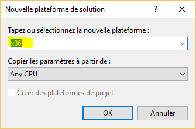

# P/Invoke une DLL 32bits ou 64bits en fonction de la plateforme

Pour notre exemple nous allons simplementer créer une application Console qui va invoquer
la DLL Lua 5.3. Lua possède une fonction "lua_version" qui retourne un pointeur sur la valeur
de la version. Comme c'est un pointeur, si nous n'utilisons pas la bonne plateforme nous
provoquons une exception. Donc nos tests sont facilement vérifiables.

Les binaires de la DLL Lua pour Windows se trouvent sur SourceForge : http://luabinaries.sourceforge.net/download.html.

## Mise en oeuvre

### Création du projet


Si vous créez un projet .Net 4.5 il faut désactiver l'option "Préférer 32 bits" pour que notre
exemple fonctionne correctement.

### Intégration de la DLL

Pour nos essais on va intégrer la [DLL 32 bits](http://sourceforge.net/projects/luabinaries/files/5.3.2/Tools%20Executables/lua-5.3.2_Win32_bin.zip/download) directement dans notre projet.


Puis on va la marquer comme contenu à copier depuis les propriétés.


### Création de la classe Wrapper

Ajouter un fichier de classe `Lua.cs`, on la rend statique puis importe la
fonction "lua_version". Comme cette fonction retourne un pointeur sur une valeur nous devons
écrire le code qui va extraire la valeur qui se trouve dans ce pointeur.

```csharp
    /// <summary>
    /// Lua DLL Wrapper
    /// </summary>
    public static class Lua
    {

        /// <summary>
        /// DLL Name
        /// </summary>
        const String LuaDllName = "Lua53.dll";

        /// <summary>
        /// Get Lua version
        /// </summary>
        /// <param name="L">Lua state. Can be null.</param>
        /// <returns>Number represents version</returns>
        [DllImport(LuaDllName, CallingConvention = CallingConvention.Cdecl, CharSet = CharSet.Ansi, EntryPoint = "lua_version")]
        private extern static IntPtr _lua_version(IntPtr L);
        public static double lua_version(IntPtr L)
        {
            var ptr = _lua_version(L);
            return (double)Marshal.PtrToStructure(ptr, typeof(double));
        }

    }
```

- Nous définissons une constante "LuaDllName" qui contient le nom de la DLL pour des raisons pratiques
- On défini la méthode "_lua_version" avec un attribut DllImport et on la déclare privée. "extern" permet de ne pas avoir à déclarer un corps de méthode
- On créé une méthode "lua_version" qui va récupérer le pointeur (IntPtr), puis on utilise les méthodes de marshaling pour convertir les données dans la mémoire pointée en donnée managée (double dans notre cas)

### Ecriture du code de test

Dans le fichier "program.cs" on écrit le code de test:

```csharp
        static void Main(string[] args)
        {
            try
            {
                Console.WriteLine("Version {0}", Lua.lua_version(IntPtr.Zero));
            }
            catch (Exception ex)
            {
                Console.WriteLine("Err ({0}): {1}", ex.GetType().Name, ex.GetBaseException().Message);
            }
            Console.Read();
        }
```

Ce code est simple, on affiche la version de la DLL en invoquant `Lua.lua-version()` avec un pointeur null ("lua_version" ne nécessite pas d'état Lua pour retourner une version).

On intercepte les erreurs dans un try/catch. On attend que l'on appui sur une touche pour quitter.

Dans l'état actuel des choses, si on exécute notre code sur un Windows 64 bits, une erreur "BadImageException" est provoquée car en étant en "Any CPU", .Net va s'exécuter selon la plateforme en cours, c'est-à-dire 64 bits. Comme notre DLL est en 32 bits, nous avons une erreur car le système à détecter un mauvais format entre l'exécutable et la DLL.


### Création des configurations de plateforme x86 et x64

Nous allons créer deux configurations de compilation pour nos tests:
- x86 pour compiler notre application en 32 bits
- x64 pour compiler noter application en 64 bits

Ouvrir le gestionnaire de configuration :


Pour créer une nouvelle plateforme cliquer sur le sélecteur "Plateforme de la solution active" et sélectionner "&lt;Nouveau...&gt;":


 
Saisir **x86** dans la nouvelle plateforme



et valider la création.

Vérifier que la nouvelle plateforme créée est sélectionnée comme plateforme active, et s'assurer que la "Plateforme" du projet est également en **x86**. 


Répéter l'opération pour créer la plateforme **x64**.

Fermer le gestionnaire de configuration.

Maintenant sélectionner la configuration **x86** pour tester le programme en 32 bits


et exécutons notre programme. Cette fois comme nous sommes en 32 bits, nous n'avons plus d'erreur de plateforme incompatible.
 


