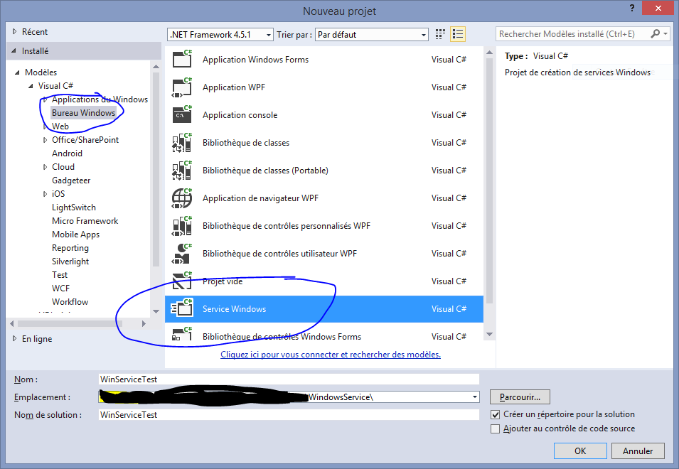
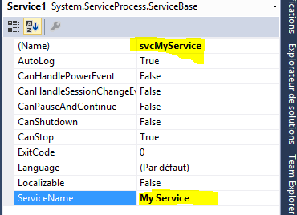
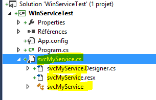
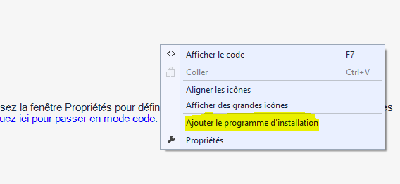
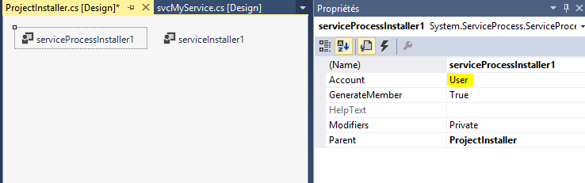
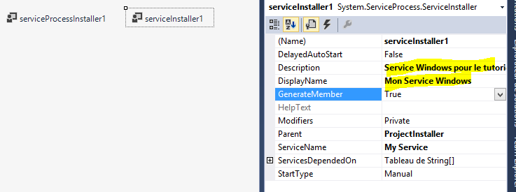

# C# : Service Windows en mode console pour le débogage et l'administration

Lorsque l'on développe des services Windows en .Net nous sommes très vite confronté au problème du débogage.

De plus nous devons régulièrement démarrer, arrêter le service, voir l'installer et le désinstaller. Toutes ces actions nécessitent d'utiliser différentes lignes de commandes (installutil, net start, etc.).

Je vous propose dans cet article de transformer votre Service Windows en mode console pour vous permettre de déboguer un peu plus facilement, ainsi que gérer tous les mécanismes de manipulation du service au travers des paramètres de lignes de commandes, et ainsi simplifier sa gestion.

Tout ce qui va être présenté n'est pas nouveau, vous trouverez pas mal de documentation sur le sujet à travers le Web, je me contente juste de rassembler le tout dans un article, comme rappel.

# Créer un Service Windows

Petit rappel pour la création d'un service "My Service":
- Lancer la création d'un nouveau projet
- Sélectionner le modèle "Modèles > Visual C# > Bureau Windows > Service Windows"




On renomme la classe "Service1" en "svcMyService" et le nom du service "My Service" dans l'éditeur de propriété ouvert:



Ensuite dans l'explorateur de solution, on renomme le fichier "Service1.cs" du service en "svcMyService.cs":



Les fichiers sous-jacents seront automatiquement renommés.

La dernière étape est de créer le programme d'installation. Depuis le designer de service (s'il a été fermé l'ouvrir en double-cliquant sur "svcMyService.cs" depuis l'explorateur de solution) faire un clic droit sur le designer et sélectionner "Ajouter un programme d'installation":



Dans le designer qui s'ouvre, sélectionner "serviceProcessInstaller1" pour pouvoir modifier le compte d'exécution du service, pour nos test nous choisirons "LocalSystem".



En sélectionnant "serviceInstaller1" on peut modifier les informations d'affichage du service dans le gestionnaire de service.



Lancer une génération du programme "Générer &gt; Régénérer la solution". Si vous lancez une exécution vous aurez une erreur vous indiquant que c'est un service qui doit être installé et démarré.

On fait un test en installant notre service, et en le démarrant:
- Ouvrir un invité de commande en tant qu'administrateur
- Se rendre dans le dossier de destination de compilation du service "bin\Debug" de la solution

On peut ouvrir directement le dossier de la solution depuis l'explorateur de solution, clic-droit sur le dossier et "Ouvrir le dossier dans l'Explorateur de fichiers" et naviguer vers "bin\Debug". Sous Windows 8.1 utiliser le menu "Fichier > Ouvrir un invite de commande > Ouvrir un invite de commande en tant qu'administrateur".

Installer le service :

```
"%SystemRoot%\Microsoft.NET\Framework\v4.0.30319\InstallUtil.exe" WinServiceTest.exe
```

Et on démarre notre service.

```
net start "My Service"
```

Normalement tout fonctionne:
- Dans le dossier de l'exécutable nous trouvons des fichiers log.
- Dans le gestionnaire de services nous trouvons notre service (avec les informations définies dans le programme d'installation).
- Dans l'observateur des journaux d'événements une nouvelle source d'affichera "My Service" si vous avez laissé "True" la valeur de la propriété "AutoLog" depuis le designer de service.

On peut tout arrêter:

```
net stop "My Service""%SystemRoot%\Microsoft.NET\Framework\v4.0.30319\InstallUtil.exe" /u WinServiceTest.exe
```

# Déboguer un Service Windows

Petit rappel, pour déboguer un service, vous devez faire plusieurs choses:
- Installer le service avec "InstallUtil.exe"
- Démarrer le service avec "net start"
- Lancer Visual Studio en tant qu'Administrateur
- Attacher le débogueur au service en cours d'exécution

Bien sûr avant de modifier votre code et de recompiler votre service, vous devez au moins l'arrêter avec "net stop".

Toute cette procédure est parfois fastidieuse, et pose également un problème en terme de débogage, si le service ne fonctionne pas correctement au démarrage, vous n'avez pas le temps d'attacher le débogueur pour tracer ce qui se passe.

# Transformer son Service en Application Console pour le débogage

L'idée pour nous faciliter le débogage est de créer une application console qui va simuler l'exécution de notre service lorsqu'il est exécuté par Visual Studio.

La première étape est de modifier le type d'application du projet.
- Clic droit sur sur le projet du service ("WinServiceTest" dans notre cas) et sélectionner "Propriétés".
- Dans l'onglet "Application", zone "Type de sortie" sélectionner "Application Console" ("Application Windows" par défaut).
- Enregistrer les modifications.


++CODE++

<h2>Avantages</h2>
Donc le premier avantage c'est de pouvoir déboguer toute la chaîne de démarrage de votre service.

Autre avantage c'est que vous pouvez créer un mécanisme de log qui s'affiche sur la console, c'est lisible et direct.
<h2>Inconvénients</h2>
Il y a toutefois quelques inconvénients.

Un service Windows s'exécute de manière générale avec un compte Administrateur (LocalSystem, LocalNetwork, etc.), ce qui peut vous poser des problèmes de droit en fonction de ce que fait votre service. Vous pouvez résoudre ce souci en exécutant Visual Studio en tant qu'administrateur, en lancer votre service il aura des droits administrateurs.

Un service, lorsqu'il démarre, exécute certaines tâches (création d'une source dans les journaux Windows, etc.) notre petite application ne fait rien de tout ça. A vous de préparer le terrain convenablement pour déboguer votre service.
<h1>Installation et Désinstallation du service</h1>
Un service pour bien fonctionner, doit être installé (il s'enregistre auprès du ServiceManager de Windows). Pour installer un service compilé en .Net il faut utiliser la commande "InstallUtil.exe" se trouvant dans le dossier du Framework .Net concerné.

C'est vite long à écrire, ou tout simplement dans une phase d'installation de votre service via un installeur, il faut repérer le bon dossier, etc.

Comme maintenant j'ai une application console comme service, je vais me faciliter la vie en permettant de provoquer l'installation et la désinstallation de mon service via des arguments de mon application console.

&nbsp;
<h1>Démarrage et Arrêt du service</h1>
Même principe que pour l'installation, pour démarrer et arrêter notre service nous devons passer par une ligne de commande "net start/stop" ou par le gestionnaire de service.

Pour les mêmes raisons que précédemment, on va faire de sorte de pouvoir démarrer ou arrêter le service grâce à des arguments de l'application console.

&nbsp;
